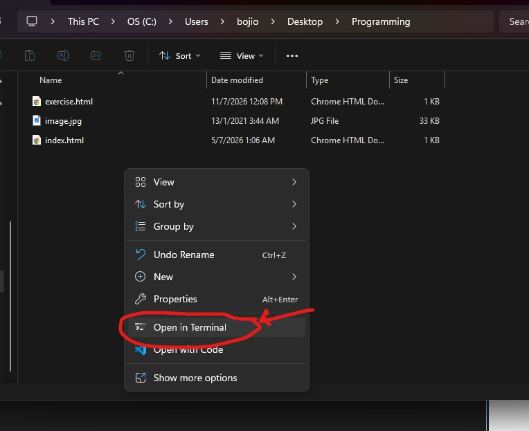
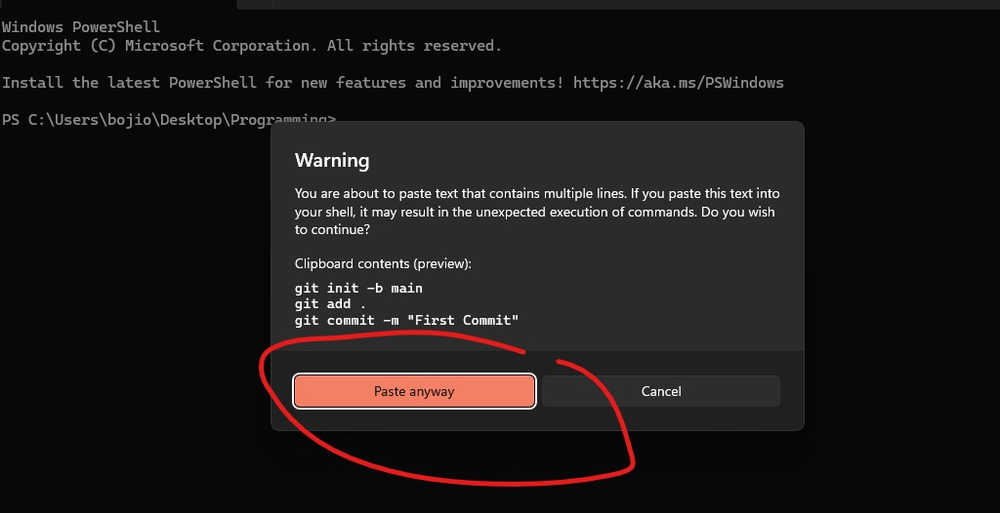
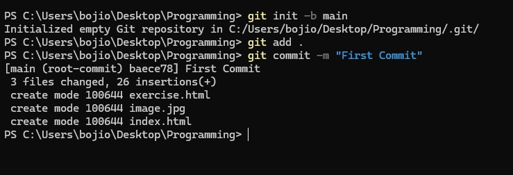
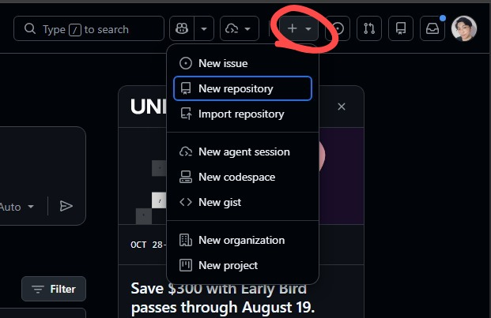
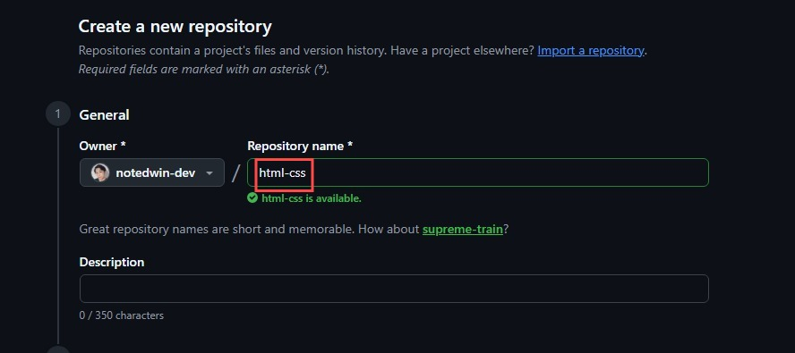
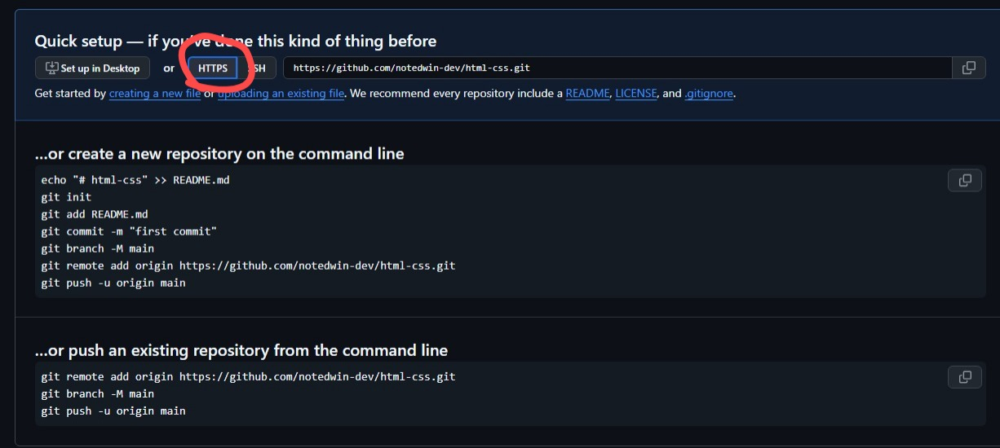
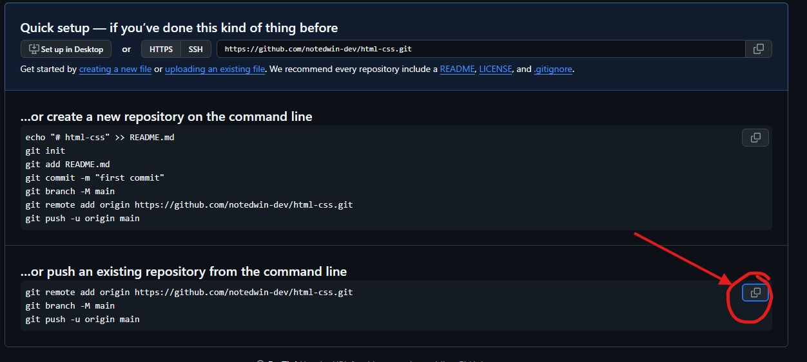
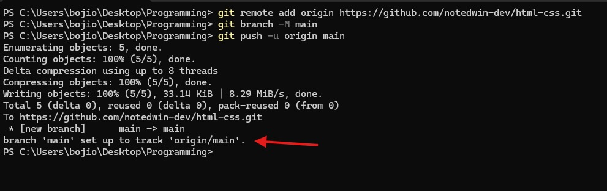
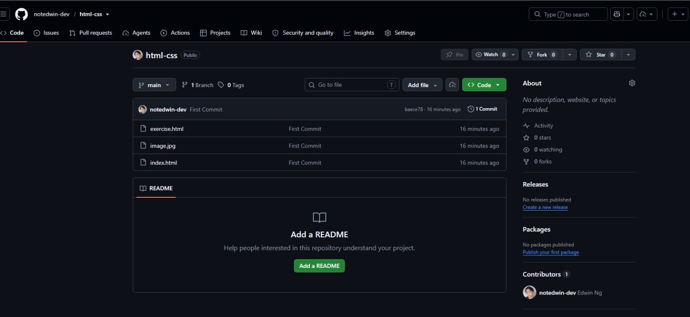

# Git Installation and Setup Guide

In this guide, you will learn how to save your code on GitHub and understand the basics of version control.

Think of GitHub as an online backup for your code. Even if something happens to your computer, your code will still be safely stored online.

---

# Prerequisites

Before starting, make sure you have:

* A laptop or desktop computer.
* Git installed on your computer.

Git is a program that keeps track of changes to your files, similar to the **Save** feature in a game or document editor.

Install Git here:

https://git-scm.com/install/windows

---

# What is Version Control and Why Do We Need It?

Version control is a system that keeps track of changes to your files over time.

A simple way to think about it is this:

> It is like having a save history for your project.

If you make a mistake or accidentally break your code, you can go back to an earlier version instead of starting over.

Git was created by Linus Torvalds, the creator of Linux.

We use version control because it helps us:

* save our work safely
* see what changed and when it changed
* undo mistakes without losing everything
* work with other people on the same project
* store our code online as a backup

---

# Git and GitHub Are Different Things

Many beginners think Git and GitHub are the same thing, but they are not.

### Git

Git is a program installed on your computer that keeps track of your changes.

### GitHub

GitHub is a website that stores your Git projects online.

You use:

**Git → on your computer**

**GitHub → on the internet**

---

# Before You Make Your First Commit

In Git, a **commit** is like pressing the **Save Game** button.

A commit creates a saved copy of your project at a specific point in time.

Think about playing a video game.

You would not play for five hours without saving your progress. If your character dies or your game crashes, you could lose everything.

Git commits work the same way.

They create checkpoints so you can always return to an earlier version if something goes wrong.

---

# Tell Git Who You Are

Before making your first commit, Git needs to know your name and email address.

Run these commands:

```bash
git config --global user.name "your-github-username"
git config --global user.email "your-github-email"
```

Example:

```bash
git config --global user.name "notedwin-dev"
git config --global user.email "notedwin.music@gmail.com"
```

This information is attached to every commit you make so Git knows who created the changes.

You only need to do this once on your computer. You usually do not need to run these commands again.

---



Go to the folder where you saved your project.

Right-click inside the folder and select **Open in Terminal**.

---

# Create Your First Git Repository

Paste these commands:

```bash
git init -b main
git add .
git commit -m "First Commit"
```

---



If Windows asks you to confirm, click **Paste Anyway** and press **Enter**.

---

# What Do These Commands Do?

### `git init -b main`

Creates a new Git repository in your folder.

In simple terms, you are telling Git:

> "Start tracking this project."

The `-b main` part creates the first branch called `main`.

---

### `git add .`

Prepares all your files to be saved.

The dot (`.`) means:

> "Include everything inside this folder."

---

### `git commit -m "First Commit"`

Creates a saved checkpoint of your project.

The message inside the quotes is a short description of what you saved.

You will make many commits as your project grows.

---

# Understanding the Git Workflow

Git works like this:

```text
Your Files
     ↓
git add .
     ↓
Staging Area
     ↓
git commit
     ↓
Local Git Repository
     ↓
git push
     ↓
GitHub
```

Think of it like this:

* `git add` = preparing files to save
* `git commit` = pressing Save Game
* `git push` = uploading your save file to the internet

---



If you see a message similar to this, it means your files have been successfully committed to Git.

At this point, your project is only saved on your computer.

The next step is to upload it to GitHub.

---

# Create Your GitHub Repository



Go to https://github.com and log in.

Click the **+** button in the top-right corner and select **New Repository**.

---



Give your repository an easy-to-remember name, such as:

* `html-css`
* `portfolio`
* `my-first-website`


Scroll down and click **Create repository**.

---

# Connect Your Project to GitHub

After creating the repository, GitHub will show you a page with instructions.



Make sure **HTTPS** is selected.

The link should start with:
```text
https://
```

and not:

```text
git@github.com
```

# Upload Your Project to GitHub



Go back to your terminal and paste the copied command:

```bash
git remote add origin YOUR_REPOSITORY_LINK
git branch -b main
git push -u origin main
```

# What Do These Commands Do?

### `git remote add origin`

Connects your project folder on your computer to your GitHub repository.

Think of it like telling Git:

> "This is where I want to upload my code."

---

### `git push -u origin main`

Uploads your commits from your computer to GitHub.

Think of it like:

> "Take my saved project and put it online."

---

You may be asked to sign in to GitHub in your browser.

After signing in, the upload will continue automatically.

---



If you see something similar to this, congratulations!

Your project has been successfully uploaded to GitHub.

---



Go back to GitHub and refresh the page.

You should now see all of your files inside the repository.

Your code is now:

✅ Saved on your computer

✅ Backed up online on GitHub

✅ Ready to be shared with other people